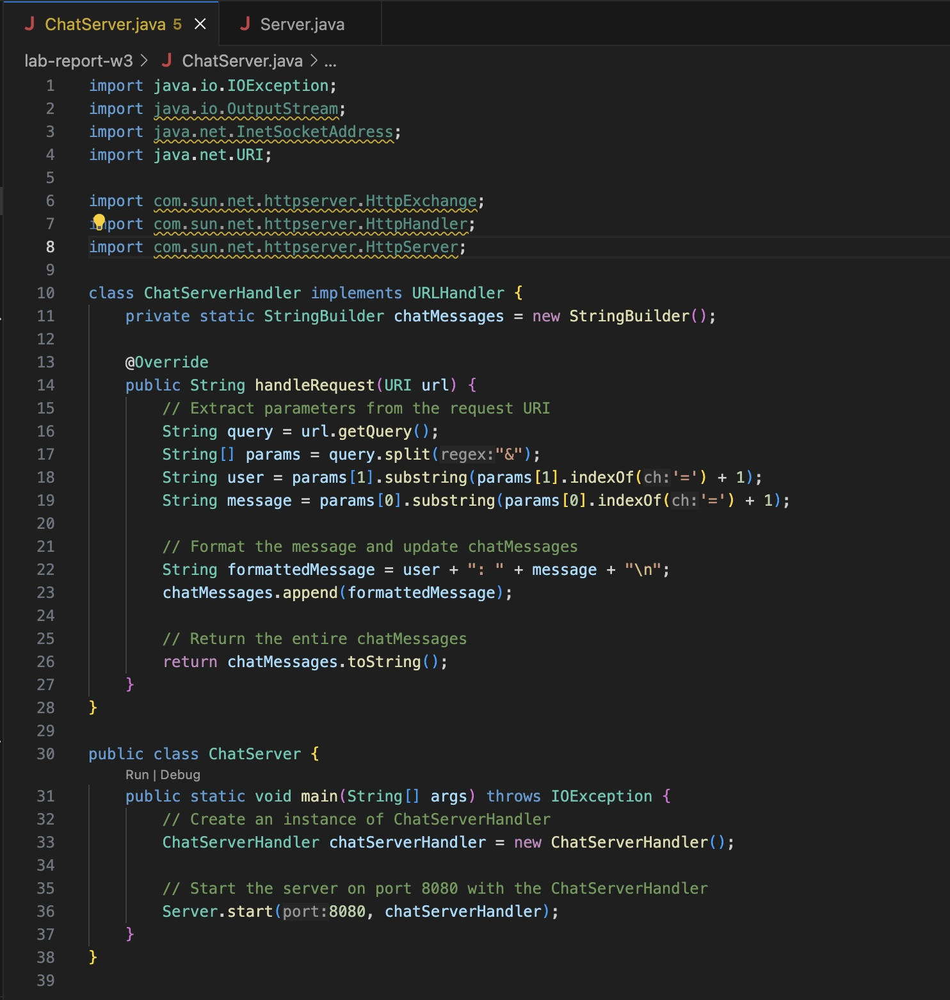

# Lab Report 2

## Part 1

### Code of `ChatServer.java`

### Screenshots of Working Page

1. Methods Called:
        AddMessageHandler.handle()

2. Relevant Arguments:
        HttpExchange exchange: Represents the HTTP request and response.

3. Values of Relevant Fields:
        user: "Syna"
        message: "Hello"
        chatMessages: "Syna: Hello\n"
        No values change in exchange fields.

1. Methods Called:
        AddMessageHandler.handle()

2. Relevant Arguments:
        HttpExchange exchange: Represents the HTTP request and response.

3. Values of Relevant Fields:
        user: "Evil Twin"
        message: "Hi"
        chatMessages: "Syna: Hello\nEvil Twin: Hi\n"
        No values change in exchange fields.

## Part 2

### Absolute Path to Public Key

`/Users/synamukherjee/.ssh/id_rsa.pub`

### Absolute Path to Private Key

`symukherjee@ieng6.ucsd.edu:~/.ssh/authorized_keys`

